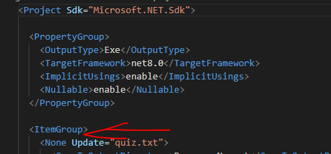

## Project maken

- maak een nieuw Console project:
    - FileIo
- zorg dat je weer een Run function hebt


## File klaar zetten

- gebruik nu:
    - voeg een txt file toe
        - noem deze even quiz.txt

## File vullen

- kopieeer even de tekst van gamequestions.txt naar de quiz.txt
    - build & run het project

- kijk in de bin/Debug/netX.0 map
    > 
    - zie je daar de quiz.txt staan?
        
## quiz.txt & copy

- in vscode:
- open je csproj file en zet het volgende erbij, ONDER <project>
    ```
    <ItemGroup >
        <None Update="quiz.txt">
            <CopyToOutputDirectory>Always</CopyToOutputDirectory>
        </None>
    </ItemGroup>
    ```
    - dus op deze plek:
        > 


- build & run nogmaals
    - nu zie je quiz wel
        > 
    
## commit

`commit` & `push` naar je git! 